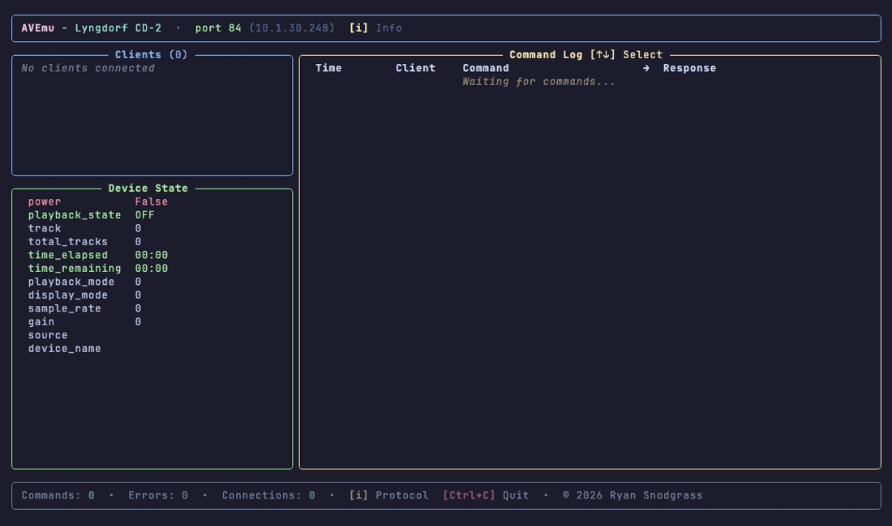
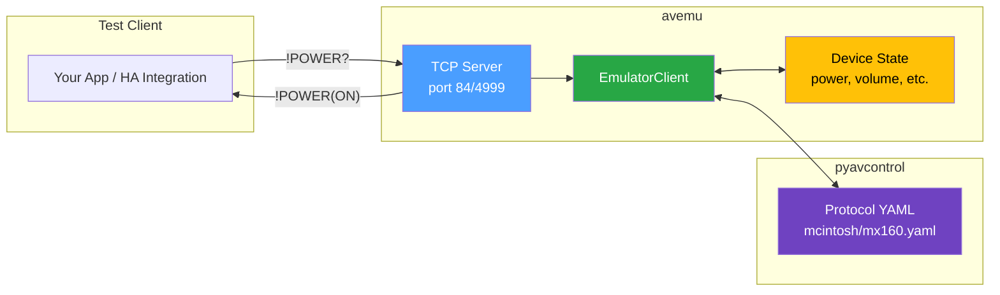

# AVEmu - Emulator for A/V Equipment RS232 Control Testing

[](http://opensource.org/licenses/MIT)

[](https://www.paypal.com/cgi-bin/webscr?cmd=_donations&business=WREP29UDAMB6G)
[](https://buymeacoffee.com/DYks67r)

## Overview

AVEmu exposes a TCP port that emulates responses to commands for A/V equipment using
[pyavcontrol](https://github.com/rsnodgrass/pyavcontrol) protocol definitions. This enables
testing client libraries and Home Assistant integrations without requiring physical hardware.



Key features:

- **Protocol-accurate responses** - Uses pyavcontrol YAML definitions for exact response formats
- **Best-effort state tracking** - Maintains device state between commands (see limitations below)
- **Multiple formats** - Supports both slash (`mcintosh/mx160`) and underscore (`mcintosh_mx160`) model IDs
- **Auto port detection** - Uses device's default IP port when available
- **Interactive TUI** - Rich terminal interface with protocol browser, help (`?`), and license (`L`) views

## How It Works



**Flow:**
1. Client connects to AVEmu's TCP server
2. Commands are parsed by `EmulatorClient` using protocol YAML definitions
3. Device state is updated and tracked between commands
4. Protocol-accurate responses are generated and returned

## Installation

```bash
pip install avemu
```

Or for development:

```bash
git clone https://github.com/rsnodgrass/avemu.git
cd avemu
pip install -e .
```

## Usage

### List Supported Models

```bash
avemu --supported
```

### Start Emulator

```bash
# just specify the model - TUI launches automatically
avemu mcintosh/mx160

# underscore format also works
avemu mcintosh_mx160

# specify custom port
avemu lyngdorf/cd2 --port 5000

# debug logging
avemu mcintosh/mx160 --debug

# disable TUI for headless / CI use
avemu mcintosh/mx160 --no-tui
```

### Connect to Emulator

```bash
# using netcat
nc localhost 84

# send commands
!POWER?
!POWER(1)
!VOL?
```

## Example Session

```console
$ avemu mcintosh/mx160
# TUI launches - shows device state, command log, and protocol info

# In another terminal:
$ nc localhost 84
!POWER?
!POWER(0)
!POWER(1)
!POWER OK
!VOL?
!VOL(50)
```

## Docker

```bash
# build with default model
docker build -t avemu .

# build with specific model
docker build --build-arg DEVICE_MODEL=lyngdorf/cd2 -t avemu .

# run
docker run -p 4999:4999 avemu
```

## Supported Devices

See [pyavcontrol SUPPORTED.md](https://github.com/rsnodgrass/pyavcontrol/blob/main/SUPPORTED.md)
for the complete list. Devices are defined in YAML format - contributions welcome.

| Manufacturer | Models              |
|--------------|---------------------|
| McIntosh     | MX-160, MX-180      |
| Lyngdorf     | TDAI-3400, CD-2     |
| Xantech      | MRAUDIO8x8, MX88    |
| Trinnov      | Altitude32          |
| HDFury       | VRROOM              |
| ...and more  |                     |

## Limitations

> **Important:** AVEmu is a protocol testing tool, not a perfect hardware emulator.

AVEmu validates that commands send valid protocol data and that responses can be parsed correctly. However, state tracking is **best-effort only** and may not match real hardware behavior.

### What AVEmu is for

- **Protocol send/receive validation** - Verify your integration sends correctly formatted commands
- **Response parsing testing** - Ensure your code handles valid response formats
- **Integration development** - Build and test without physical hardware
- **CI/CD automated testing** - Include protocol tests in your test suite

### What AVEmu is NOT for

- **Exact device behavior validation** - Real devices have nuances AVEmu doesn't emulate
- **State machine correctness** - Setting `volume=20` then querying may not return `20`
- **Timing-sensitive operations** - AVEmu responds immediately without realistic delays
- **Complex device logic** - Features like input auto-switching, protection circuits, etc.

### TUI Keyboard Shortcuts

| Key | Action |
|-----|--------|
| `i` | Protocol information panel |
| `?` | Help / limitations |
| `L` | View license |
| `j/k` or `↑/↓` | Navigate |
| `/` | Search (in info panel) |
| `Enter` | Show details |
| `ESC` | Close panel |
| `q` | Quit |

## Support

If you find this tool useful, please consider contributing:

[](https://www.paypal.com/cgi-bin/webscr?cmd=_donations&business=WREP29UDAMB6G)
[](https://buymeacoffee.com/DYks67r)

## License

AVEmu is released under the Business Source License (BSL).

- ✅ Free for home, hobby, and non-commercial use
- ✅ Free for Home Assistant users who are not charging for services
- 💼 Paid license required if you use AVEmu commercially

If you make money using AVEmu, we ask that you [support the project by
purchasing a commercial license](https://av-control.lemonsqueezy.com/).

## See Also

- [pyavcontrol](https://github.com/rsnodgrass/pyavcontrol) - Protocol definitions library
- [ha-avcontrol-transport](https://github.com/rsnodgrass/ha-avcontrol-transport) - Home Assistant integration
